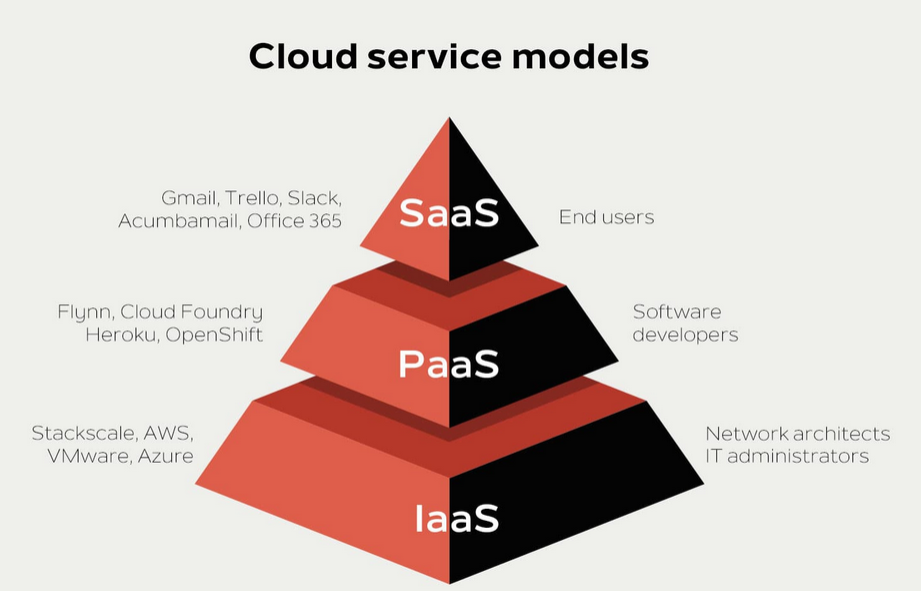

## What is Cloud Computing?

Cloud computing means using the internet to access computers, storage, software, and other IT services instead of depending only on your own device or office computers. In simple words, the "cloud" is just a group of powerful computers on the internet that you can use when needed.

For example, when you save photos in Google Drive, watch videos on YouTube, or use Gmail, you are using cloud services. You are not keeping everything only on your phone or laptop. The cloud stores or processes the data for you.

### Why Cloud Computing is Useful

Cloud computing offers several important advantages:

- **Saves Money** — You do not need to buy many expensive machines.
- **Saves Space** — You do not need a lot of physical hardware at your location.
- **Flexible** — You can use more or less resources whenever needed.
- **Easy Access** — You can use it from anywhere with an internet connection.
- **Easy Management** — The cloud company handles many technical tasks for you.

### Main Idea

Cloud computing gives services on demand, which means you can get them when you need them, like electricity or water.

---

## On-Demand Delivery of IT Services

On-demand delivery means services are available immediately when the user wants them. You do not need to wait for a company to set up physical machines for you. You can simply request the service and start using it.

### Example

If a school website suddenly gets many visitors during admission time, it can quickly get extra storage or more server power from the cloud. After the busy time is over, it can reduce the resources again. This is very useful because the system becomes faster, cheaper, and more efficient.

### Features of On-Demand Delivery

- Fast access to services whenever needed
- Easy scaling up or scaling down based on demand
- Pay only for what you use
- No need to buy and install everything yourself

---

## Cloud Service Models

There are three main cloud service models: **IaaS**, **PaaS**, and **SaaS**. Each model offers different levels of control and management.

### IaaS — Infrastructure as a Service

**IaaS** means Infrastructure as a Service. It is the cloud model where the provider gives you the basic building blocks of computing, such as servers, storage, networking, and virtual machines.

**Simple Analogy:** Think of it like renting an empty house. The house is ready, but you still need to arrange the furniture and manage daily life. In the same way, with IaaS, the cloud company gives the hardware foundation, but you manage the operating system, applications, and data.

#### What the Provider Manages in IaaS

- Physical servers
- Storage systems
- Networking equipment
- Data center maintenance

#### What You Manage in IaaS

- Operating system
- Applications
- Data
- Some security settings

#### Example of IaaS

A company wants to host its own website or app. Instead of buying physical servers, it rents virtual servers from the cloud. This is cheaper and easier to expand later.

#### When IaaS is Useful

- When you want full control over your system
- When you need to install your own software
- When your business grows and you need flexible resources

---

### PaaS — Platform as a Service

**PaaS** means Platform as a Service. It gives a ready-made platform where developers can build, test, and run applications without worrying about the lower-level hardware and system setup.

**Simple Analogy:** Think of it like renting a fully equipped kitchen. You do not need to build the kitchen or buy the oven, stove, and sink. You just use the kitchen to cook. Similarly, in PaaS, the cloud provider gives the tools and environment needed to develop software.

#### What the Provider Manages in PaaS

- Servers
- Storage
- Networking
- Operating system
- Runtime environment
- Development tools

#### What You Manage in PaaS

- Your application code
- Your data
- How your app works

#### Example of PaaS

A developer wants to create a web app. The cloud platform gives the environment to write code and deploy it quickly. The developer does not need to set up servers manually.

#### When PaaS is Useful

- When programmers want to build apps quickly
- When they do not want to waste time managing servers
- When they want easy testing and deployment

---

### SaaS — Software as a Service

**SaaS** means Software as a Service. It is the cloud model where the user directly uses software over the internet. The software is already made, and you do not need to install or maintain it yourself.

**Simple Analogy:** Think of it like eating at a restaurant. You do not cook the food, buy the ingredients, or clean the kitchen. You just use the service. In the same way, with SaaS, you simply open the software and use it.

#### What the Provider Manages in SaaS

- Servers
- Storage
- Networking
- Software updates
- Security
- Maintenance

#### What You Manage in SaaS

- Usually just your account and your own data

#### Examples of SaaS

- **Gmail** — Email service
- **Google Docs** — Document creation and editing
- **Microsoft 365** — Office applications
- **Zoom** — Video conferencing
- **Dropbox** — File storage and sharing

#### When SaaS is Useful

- When you want software ready to use
- When you do not want to install anything
- When you want access from any device

---

## Comparison: IaaS vs PaaS vs SaaS

### Quick Comparison Table

| Model | Full Form | What You Get | What You Manage | Best For |
|-------|-----------|--------------|-----------------|----------|
| **IaaS** | Infrastructure as a Service | Servers, storage, networking | OS, applications, data | Users who want control |
| **PaaS** | Platform as a Service | Ready platform for development | Your app and data | Developers building apps |
| **SaaS** | Software as a Service | Ready-to-use software | Just your account & data | Regular users/non-technical |

### Control and Management Levels

**IaaS**

- Gives the most control
- Best for users who know technical things
- You manage more parts yourself

**PaaS**

- Gives medium control
- Best for developers
- The platform is already prepared for coding

**SaaS**

- Gives the least control, but the most convenience
- Best for normal users
- Just sign in and use the software

### Easy Memory Tricks

**By Component:**

- **IaaS** = Infrastructure

- **PaaS** = Platform
- **SaaS** = Software

**By Management Responsibility:**

- **IaaS** = "I manage more"
- **PaaS** = "Provider manages more"
- **SaaS** = "Provider manages almost everything"

---

## Real-Life Example: Building an Online Shopping Website

Suppose a company wants to start an online shopping website. Here's how different cloud models would help:

### Using IaaS

With IaaS, the company rents servers and storage from the cloud provider, then builds and manages everything itself. The company has full control but also full responsibility for the entire system.

### Using PaaS

With PaaS, the company gets a ready platform and development environment. It only needs to write the shopping app code. The provider handles servers, storage, and infrastructure.

### Using SaaS

With SaaS, the company uses a ready-made shopping software service. It does not build anything. It just customizes and uses the existing platform.

---

## Summary

**Cloud computing** gives IT services through the internet, allowing you to access powerful resources without maintaining physical hardware.

**On-demand delivery** means you can use services whenever needed and pay only for what you use.

- **IaaS** gives basic resources like servers and storage; you manage the operating system and applications.
- **SaaS** gives ready-made software; you manage only your account and data.

Each model offers different levels of control and convenience, making cloud computing flexible for different types of users and businesses.
