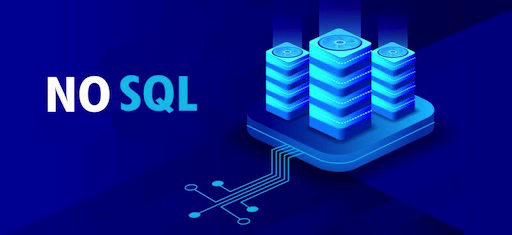
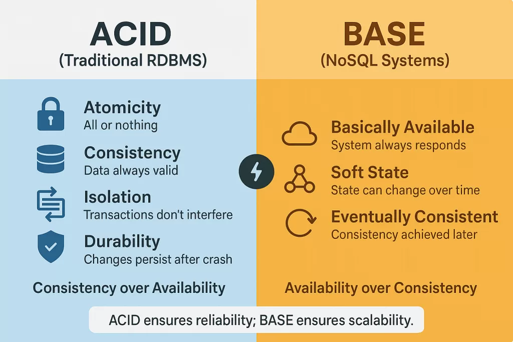
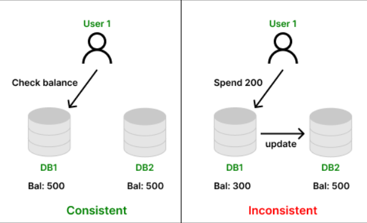
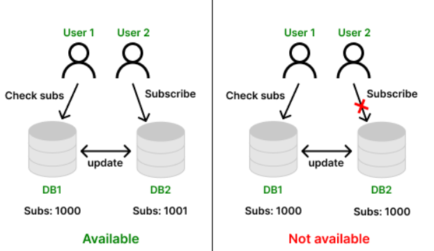
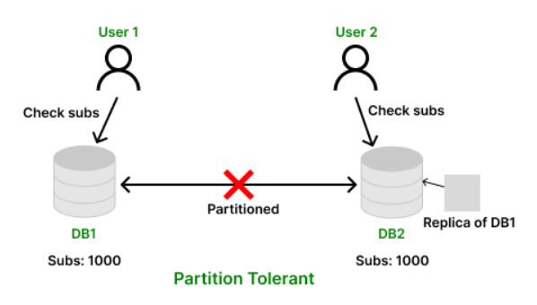
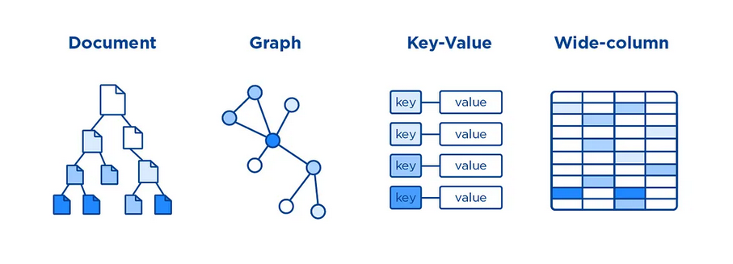
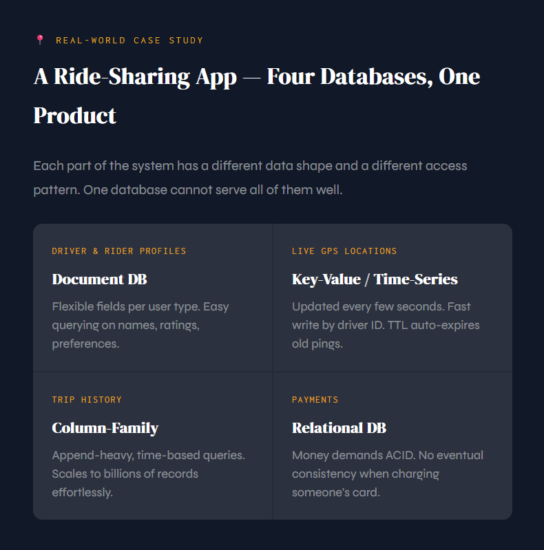

---

Database Systems · A Wake-Up Call

## Your Database Will Betray You

*A wake-up call on why the web stopped fitting its data into neat little tables and what happened next.*

It works perfectly right now. 100 users, no problems. But something is coming and when it does, your carefully designed SQL schema will be the thing that kills your app.

---

## The Story

### It Starts Perfectly

You spend three months building your app. Database schema is clean. Queries are fast. You deploy it. A hundred users sign up on launch day. Everything works.

Then it gets on Reddit.

| Users | What Happens |
|---|---|
| **100 users** | Queries run in ~12ms. Everything is fine. |
| **10,000 users** | Queries slow to 800ms. Page loads drag. Users notice. You refresh your monitoring dashboard obsessively. |
| **100,000 users** | Database locks up. Connections pile up. Your server returns 503 errors. Your inbox fills with angry emails. |

Here's the question nobody asks you in your database class:

> *What changed? The code didn't. The queries didn't. The schema didn't. Only the users did.*

That's the betrayal. The database that saved you at 100 users is the same one strangling you at 100,000. And the worst part? **You designed it correctly.** You normalized your tables. You added indexes. You followed every rule.

It just doesn't matter at scale.

This is not a bug. It's a fundamental property of how relational databases are built and understanding it is the first step to understanding why NoSQL was invented.

## The Proof

### Even the Best Engineers Couldn't Fix It

You might be thinking: *"Maybe my app just wasn't optimized enough. Better engineers would have made it work."*

Let's look at what happened to some of the best engineering teams in the world.

**Facebook - The Wall Problem**

In 2007, Facebook's social graph, who knows whom, who likes what, became impossible to model in relational tables. Every friend-of-a-friend query was a join across millions of rows. They eventually built their own graph storage engine. SQL just isn't shaped like relationships.

[→ Read the official Facebook Engineering post](https://engineering.fb.com/2013/06/25/core-infra/tao-the-power-of-the-graph/)

**Netflix - The Scale Problem**

Netflix serves 200+ million users across the globe simultaneously. A single database server even the most powerful one money can buy, cannot handle that. Netflix moved to Apache Cassandra, a NoSQL database that runs on hundreds of servers at once. They literally cannot go back.

[→ Read the official Netflix Tech Blog post](https://netflixtechblog.com/nosql-at-netflix-e937b660b4c)

**Twitter - The Write Speed Problem**

At peak, Twitter handles 500,000 tweets per second. A relational database writes to a single primary node. That bottleneck becomes lethal at this volume. Twitter routes writes to distributed systems that don't need to coordinate the way RDBMS does.

[→ Read the official Twitter Engineering post](https://blog.x.com/engineering/en_us/a/2010/introducing-flockdb)

**Amazon - The Latency Problem**

Amazon's internal research found that every 100ms of latency costs them 1% in sales. They built DynamoDB, one of the world's most influential NoSQL databases, because even tiny query slowdowns at their scale translate to millions in lost revenue.

[→ Read the official Amazon Science post](https://www.amazon.science/latest-news/amazons-dynamodb-10-years-later)

These aren't startup mistakes. These are the companies that *wrote* the textbooks your professors are teaching from. And they all hit the same wall.

> **The relational database wasn't broken. It was just designed for a world where "massive scale" meant a few thousand concurrent users, not a few hundred million. The internet changed the definition of scale. The database had to follow.**

### What If Some Databases Return Wrong Data, On Purpose?

Your relational database makes you a promise: every read returns the *most recent, correct version* of your data. Always. No exceptions. This promise is called **ACID**.

But it comes at a cost. To keep that promise, the database must lock rows, check constraints, synchronize every node, and make the entire cluster agree before responding. At scale, all of that coordination becomes your bottleneck.

So distributed systems engineers asked a radical question: **What if we relax the promise?**

### Introducing BASE - The NoSQL Philosophy

BASE is the alternative to ACID. It doesn't guarantee perfection. Instead, it guarantees something more pragmatic: the system will stay alive, stay fast, and eventually get the data right, even if there's a small window where different users see slightly different things.

**B - Basically Available**
> The system always sends a response. Even if one node is down, another handles the request. No timeouts, no errors, maybe slightly stale data, but something, not nothing.

**A - Soft State**
> The state of the system is fluid and always shifting. Nodes are constantly communicating to sync. Data is "in motion" settling toward truth rather than being rigidly locked in it.

**S - Eventually Consistent**
> If you write data to Node A, Nodes B and C will catch up within milliseconds. Not instantly, but soon. For most use cases, "soon" is more than good enough.

---

Here's how it works in real life:

Here's BASE in real life: when you hit **Like** on an Instagram post, the counter you see might be off by a handful for a fraction of a second, while data centres around the world sync up. Then it corrects. You never noticed. You never cared.

But if your bank balance worked that way? You'd care enormously. That's why banks still use ACID. **The right model depends entirely on your problem.**

## The Iron Rule

### The Law That Governs Every Distributed Database

In 2000, a computer scientist named Eric Brewer proved something uncomfortable. In a distributed database system cannot guarantee Consistency, Availability, and Partition Tolerance all at the same time—at most, you can only ever guarantee two of these three properties at the same time. You cannot have all three. Ever.Understanding this balance helps developers choose the right priorities to create systems that perform reliably in real-world distributed environments.

> **The theorem is frequently associate a NoSQL databases. It because their can scale out (horizontally) easily.**

### CAP Theorem Properties

1. Consistency

Every node returns the same, most recent data. All clients see the same version at the same time. No stale reads.

Example: You have ₹500. You spend ₹200. Every database node must immediately show ₹300, not ₹500 on one node and ₹300 on another.

2. Availability

Every request gets a response. No node ever says "sorry, try later." Even if some nodes are failing, the system keeps responding.

Example: User B is far from User A but tries to subscribe. An available system must process that request, no matter the distance or node state.

3. Partition Tolerance

The system keeps running even if nodes lose contact with each other. A network cable breaks, the system doesn't crash. It carries on.

Example: Network outage splits DB into two halves. User B still sees subscriber count from the replica, the system stayed alive despite the split.

### Brewer's CAP Theorem, in a distributed system, you can only pick two

### Possible combinations

## CP - Consistency + Partition Tolerance

When we choose CP, our system will be consistent even if some partitions happen, but there isn't guarantee that our system will be fast and available all the time. If a partition happens, the system will prioritize consistency over availability, which means that some requests may be rejected or delayed until the partition is resolved.

> Refuses requests during a network split rather than return stale data. Correct or silent. Used in banking, ticket booking, stock markets.

**(Dis)Advantages:**

- Slow down performance;
- Consistency system;
- System/Nodes can be unavailable.

Examples: Apache HBase, MongoDB, Redis.

**Real-World Example - The Bank Balance**

You have **₹500** in your account. You open your banking app on your phone and transfer ₹200 to a friend. At the exact same moment, your wife uses the debit card at a shop to pay ₹400.

Both transactions hit different database nodes at the same time.

Now imagine the bank used an **AP system** - prioritizing availability over consistency.

- Node A processes your transfer: sees ₹500, deducts ₹200, shows ₹300 ✓
- Node B processes the card payment: also sees ₹500 (hasn't synced yet), deducts ₹400, shows ₹100 ✓

Both transactions go through. But you only had ₹500. The bank just lost ₹200. You effectively spent ₹600 you didn't have. This is why banks use **CP systems.**

When your wife swipes the card, the system locks the account, checks the real balance across all nodes, and only then approves or declines. If two nodes can't agree, one transaction gets blocked — not both approved.

**Correct or silent. Never wrong.**

### AP - Availability + Partition Tolerance

Choosing AP, our system will lost consistency, but gain availability (responding all request but can have diff responses between node) and speed (nodes not need to be consistent, so syncronyzation will not happen).

Here when some writing happens in one node, another one won´t have the same state as the written one, because they aren´t syncronized. Also, when some partitions happen the partition node can still responding and writing, even if with outdated state.

> Always responds, even during failures. Data might be slightly stale, it corrects later. Used in social media, streaming, content platforms. Example; Facebook like counts or Twitter timelines.

**(Dis)Advantages:**

- High availability;
- Fast;
- Poor consistency.

Examples: DynamoDB, Cassandra, CouchDB

**Real-World Example - The Instagram Like Count**

You are scrolling Instagram. A viral post just hit **10,000 likes**. You see **9,998 likes**. Your friend sitting next to you, on the same post, sees **10,000 likes**.

You are both looking at the same post. You are seeing different numbers.

Is the app broken? No. This is **AP working exactly as designed.**

Instagram's servers are spread across data centres in the US, Europe, and Asia.
When someone in Japan likes the post, that like hits the Japan node first.
Your node in Bhutan hasn't received that update yet — it takes a few milliseconds to sync.

For those few milliseconds, different nodes show different counts.
Then they catch up. You refresh. You see 10,000.

Nobody was harmed. The app never went down. That is the trade-off AP makes —
**always available, eventually correct.**

### What about CA - Consistency + Availability?

CA sounds ideal, but it's a trap. CA systems cannot tolerate network partitions, which means they must run on a single server (monolithic). The moment you distribute across multiple machines, partitions become inevitable. So CA is only possible without distribution, which defeats the whole purpose of building a distributed system. This is why real-world distributed databases only choose CP or AP.

### So what's the actual choice?

In real distributed systems, P (Partition Tolerance) is not optional. Networks fail. Cables break. Cloud regions go down. You must tolerate partitions or your system crashes the moment anything goes wrong. So the real choice is always: CP or AP?

**Choose CP when…**

- **Bank transfers** - wrong balance = disaster
- **Ticket booking** - two users, one last seat
- **Stock trading** - stale price = lawsuits

**Choose AP when…**

- **Social media likes** - off by 3 for 50ms? Fine.
- **Netflix streaming** - availability matters most
- **News feeds** - slightly stale is acceptable

**💡 Tunable Consistency - the best of both worlds**

Many modern NoSQL systems like Cassandra don't lock you into one choice globally. You can set consistency per operation, strong quorum for a payment write, relaxed for a social feed read. This is called tunable consistency and it's one of the most powerful features in distributed database design.

## Not all data fits into rows and columns

Here's the aggressive truth: if you designed your entire system using only relational tables, you've already made a mistake. Not because SQL is bad, it's brilliant at what it does. But not every problem is shaped like a table.

Consider: how do you store a social network in a table? You could have a friends table with two columns; user_id and friend_id. But finding "friends of friends" means joining that table with itself, repeatedly, across millions of rows. It's technically possible. It's also impossibly slow at scale.

Or consider a product catalogue. Each product has different attributes, a laptop has RAM and CPU specs, a shirt has size and colour, a book has author and ISBN. In a relational database, you either create a massive table with hundreds of mostly-empty columns, or you do clever tricks that destroy query performance. Neither is good.

The main focus of NoSQL databases is to provide horizontal scalability, a flexible data model, and high availability. Therefore, most NoSQL databases do not support relationships, which is also not their strong suit.

However, some NoSQL databases offer functionality that allows for some degree of relationships between data, for example:

- **Key-Value Stores:** A giant distributed dictionary. Give it a key, get a value instantly. No complex queries. No joins. Blindingly fast for what it does. Perfect for caching, sessions, rate limiting, and leaderboards.
Example; Redis · DynamoDB · Riak

- **Document Databases:** Store data as flexible JSON documents. No fixed schema, each document can have different fields. Rich queries on nested data, arrays, and embedded objects. Ideal for user profiles, catalogues, and content with varying structure.
Example; MongoDB · CouchDB · Firestore

- **Column-Family Stores:** Wide rows where each row can hold different columns. Built for colossal write throughput. Schema design is query-driven, you model around access patterns, not around the data shape. Built for IoT, logging, and analytics at planet scale.
Example; Apache Cassandra · HBase · ScyllaDB

- **Graph Databases:** Data stored as nodes and edges. Traversing relationships, friend-of-friend, shortest path, fraud patterns, is a first-class operation, not a painful multi-join query. Essential for social networks, fraud detection, and recommendation engines.
Example; Neo4j · Amazon Neptune · JanusGraph

- **Time-Series Databases:** Optimized for timestamp + metric + value data. Massive write throughput, automatic downsampling, efficient storage of time-ordered sequences, and built-in retention policies. Purpose-built for monitoring, IoT sensors, and financial tick data.
Example; InfluxDB · TimescaleDB · Prometheus

- **Vector Databases:** Store high-dimensional embeddings from AI/ML models and search by similarity, not by exact match. The backbone of semantic search, RAG pipelines, image similarity, and every modern LLM-powered feature. The newest and fastest-growing category.
Example; Pinecone · Weaviate · Milvus

### RDBMS vs NoSQL: the honest comparison

NoSQL is not a replacement for relational databases. It's a different tool for different problems. Here's the full comparison; know this for your exam and for real engineering decisions:

| Aspect | Relational DB (RDBMS) | NoSQL DB|
|---|---|---|
| **Data Model** |  Tables with rows and columns | Key-value, document, column-family, graph, etc. |
| **Schema** | Rigid, defined upfront, hard to change | Flexible or schema-less, evolves with your app |
| **Query Language** | SQL - standardized, powerful | Proprietary APIs, JSON-based queries |
| **Joins** | Native, highly optimized | Usually avoided, denormalize instead |
| **Transactions** | Full ACID guarantees | Often BASE; some support multi-document ACID |
| **Scaling Strategy** | Vertical scaling | Horizontal scaling |
| **Consistency** | Strong by default | Tunable - from eventual to strong |
| **Best For** | Finance, OLTP, strictly structured data | Big data, real-time, AI/ML, IoT, social platforms |

The classic analogy: an RDBMS is like a highly regulated library, every book catalogued, every reference cross-checked. NoSQL is like a modern high-throughput warehouse, optimized to process a million incoming shipments per second, slightly less precious about filing order.

### The two questions that always work

Every bad database decision comes from the same mistake: picking a technology first, then figuring out how to make the data fit. The right process is always the opposite. Ask these two questions before you do anything else:

- Only need lookups by a single unique key?
  - Key-Value Store (Redis, DynamoDB)

- Flexible JSON-like documents, rich field queries?
  - Document Store (MongoDB, CouchDB)

- Massive write volume, time-based or append-heavy workload?
  - Column-Family (Cassandra) or Time-Series (InfluxDB)

- Complex relationship traversals (friends, fraud, recommendations)?
  - Graph Database (Neo4j, Amazon Neptune)

- AI/ML semantic search, embeddings, similarity?
  - Vector Database (Pinecone, Milvus)

- Money, payments, inventory; legally critical transactions?
  - Relational DB. Don't switch. ACID is non-negotiable here.

Real production systems rarely use just one database. The best engineering teams practise what's called **polyglot persistence,** using the right tool for each distinct workload within the same application.

### Real-World Case Study

### Three Rules. (Must remember)

Everything else in NoSQL follows from these three.

1. Your data model and your query patterns decide your database, not trends, not what Netflix uses, not what your friend recommended.
2. Scale is a spectrum. Know where you are today. Design for where you are going tomorrow.
3. ACID and BASE are not good versus evil. They are tradeoffs. Know which one your specific problem actually needs.
