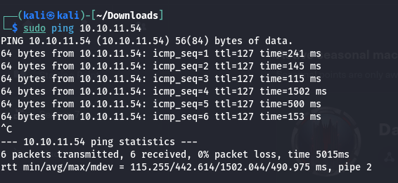

# **Ping**

I verified whether I could communicate or if the IP address was up.

The IP address is up. Now I can communicate with the IP address.

---

# **Nmap**

Then used Nmap to 

.png)

.png)

## - **Version detection scan**

.png)

### **Result**

There are two open ports:
- 22 ssh and,
- 80 http

---

# **Web enumeration**

I used wappalyzer extension to find the framework the website used.

.png)

## **Whatweb**

Upon researching I found the tool called *whatweb* that also detects the framework used same like the wappalyzer.

[whatweb | Kali Linux Tools](https://www.kali.org/tools/whatweb/)

.png)

.png)

### **Result**

I found that the website used:
- The web server used is nginx version 1.22.1.
- Used Bootstrap for front-end.

Then I checked the vulnerability of nginx 1.22.1 in exploit database, but I found nothing.

.png)

---

Then I searched the IP address and I was navigated to the drip.htb and this error appeared:

.png)

DNS resolution is not setup in **/etc/hosts** file. Now let's resolve the DNS resolution using vim (text editor).

.png)

.png)

After solving the DNS resolution I was directed to the `/index` directory and got this page:

.png)

I navigated to the sign-in page and then found this:

.png)

I was then navigated to the **mail.drip.htb**

Same like the drip.htb error, I resolved the DNS by editing the **/etc/hosts** file.

.png)

.png)

Then I was able to find the page and I found this login page:

.png)

---

I then used **ffuf** to brute force the directory:

.png)

### **Result**

- Found mail.

This mail subdomain was already found when I navigated to the sign-in page.

.png)

### **Result**

- Found contact  
- index.html  
- register

---

I have registered as a user to find out what the website is about:

.png)

After signing in I found this page:

.png)

- The page is mainly about the mails.

---

Then I was stuck here so I backtracked it and again gathered information.

---

# **Enumeration**

## **WPScan**

I browsed the tools that are used to scan the subdomains and I found this WPScan.

- WPScan is used for searching for vulnerabilities, such as weak passwords and outdated plugins.

.png)

I was not able to get the result because the website is not running on WordPress.

- I understood that the WPScan is used for the website using WordPress.

---

## **Ferric Oxide**

I then found a tool called Ferric Oxide.

.png)

### **Result**

- Found only two 200 status code. Both are the same. It is the landing page.

---

## **Nikto**

Nikto scans for insecure files and programs.

.png)

### **Result**

I have found that the **X-Content-Type-Options** header is not set.

- This could allow browsers to interpret files in unintended ways, leading to security issues like MIME-type sniffing attacks.
- Found multiple index files: `/index.php`, `/index.asp`, `/index.html`, `/default.aspx`, etc.
