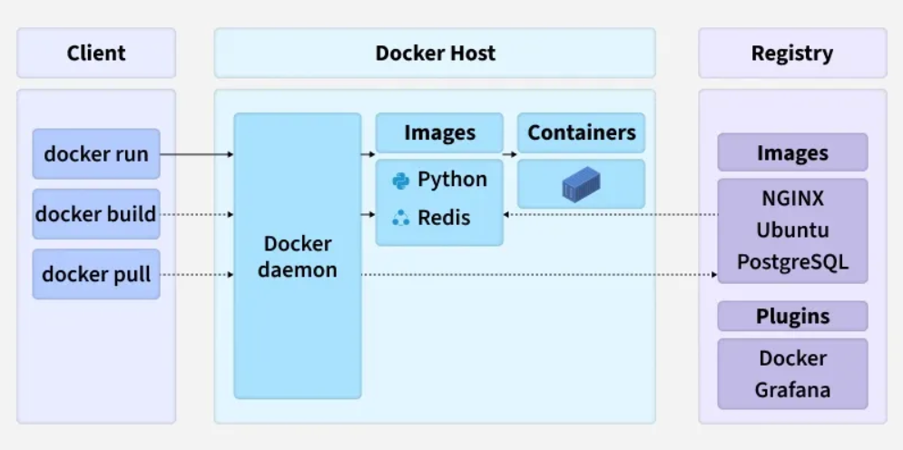

# Architecture of Docker

Docker uses a client–server architecture. The Docker client talks to the Docker Daemon, which builds, runs, and manages containers.
They communicate through a REST API via UNIX sockets or a network interface.

- Docker is based on a client–server model.
- The Docker client sends requests to the Docker Daemon.
- The Docker Daemon handles container lifecycle tasks.
- Communication happens over a REST API using sockets or networks.

