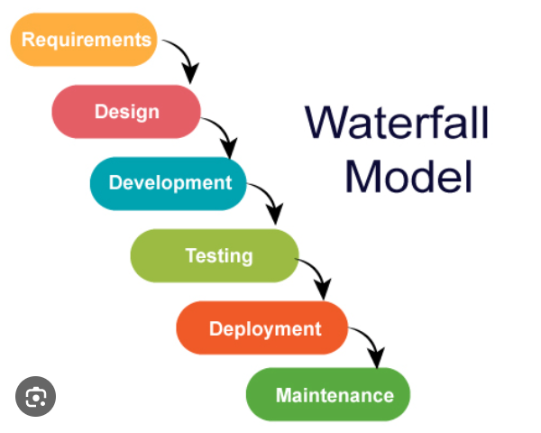
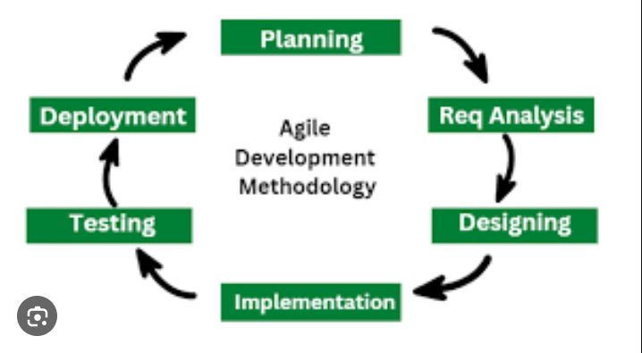
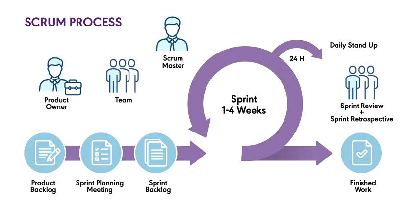

## What is the Software Development Life Cycle (SDLC)?

The **Software Development Life Cycle (SDLC)** is a structured framework that defines the overall process of software development from inception through retirement. It encompasses all activities, phases, and methodologies used to plan, design, develop, test, deploy, and maintain software applications. SDLC provides a systematic approach to software engineering, ensuring quality, consistency, and predictability throughout the development journey.

The primary goal of SDLC is to establish a set of guidelines and processes that development teams follow to create reliable, efficient, and maintainable software products. By implementing a well-defined SDLC, organizations can manage complexity, reduce risks, control costs, and deliver products that meet or exceed stakeholder expectations.

## Why SDLC is Essential

SDLC is critical for modern software development for several key reasons:

- Preventing Chaotic Development
- Ensures Quality and Reliability
- Manages Risk and Cost
- Facilitates Collaboration
- Enables Scalability

---

## SDLC Models and Methodologies

Different projects have different requirements, constraints, and characteristics. Various SDLC models have been developed to address these different scenarios. The main models are:

### 1. Waterfall Model: The Traditional Approach

The **Waterfall model** is a linear, sequential approach to software development. It follows a strictly organized flow where each phase must be completed before the next one begins, with minimal backtracking.

#### Key Phases of the Waterfall Model

**Requirements Analysis**

In this initial phase, all project requirements are gathered, analyzed, and thoroughly documented in a **Software Requirement Specification (SRS)** document. This comprehensive document serves as the contract between stakeholders and the development team, detailing:

- Functional requirements (what the system should do)
- Non-functional requirements (performance, security, scalability)
- Business rules and constraints
- User stories and acceptance criteria

Before development begins, all stakeholders must approve these requirements, ensuring alignment from the start.

**System Design**

Once requirements are locked, the technical architecture is designed. This phase produces design specifications that include:

- Database schema and data models
- System architecture and component interactions
- User interface mockups and prototypes
- Hardware and infrastructure requirements
- Technology stack decisions
- Security architecture and protocols

This design document serves as the blueprint that developers follow during implementation.

**Implementation (Coding)**

Developers write code based on the finalized design specifications. Work is typically organized into small, manageable units that are developed in parallel, then later integrated into the complete system. Code reviews and adherence to coding standards ensure consistency and quality.

**Testing (Verification)**

After implementation is complete, the integrated software undergoes comprehensive testing to:

- Identify and document defects
- Verify that the system meets all original requirements
- Test edge cases and error conditions
- Perform performance and stress testing
- Ensure compatibility across intended platforms

Only after successful testing does the product move forward.

**Deployment (Operation)**

The product is released to the customer or installed in the live production environment. This phase includes:

- Installation and configuration of infrastructure
- User training and documentation
- Data migration from legacy systems (if applicable)
- Establishment of operational procedures
- Monitoring and initial support

**Maintenance**

Ongoing support is provided after deployment to:

- Fix bugs discovered in production
- Make improvements based on user feedback
- Adapt the software to new business requirements
- Apply security patches and updates
- Optimize performance based on real-world usage

#### Characteristics, Advantages, and Disadvantages of Waterfall

**Characteristics:**

- **Sequential flow:** Each phase strictly follows the previous one
- **Clear milestones:** Easy to track progress and identify delays
- **Comprehensive documentation:** Detailed records of all decisions and specifications
- **Fixed scope:** Requirements are locked early in the process

**Advantages:**

- **Easy to manage:** Clear structure makes project management straightforward
- **Disciplined documentation:** Excellent for knowledge transfer and long-term maintenance
- **Predictable timeline and budget:** Fixed requirements enable accurate estimation
- **Well-suited for fixed contracts:** Works well when requirements are contractually binding
- **Clear accountability:** Easy to identify who is responsible for each phase

**Disadvantages:**

- **Inflexible to changes:** Adding or modifying requirements after the requirements phase is costly and disruptive
- **High risk for large/complex projects:** Issues discovered late in the project are expensive to fix
- **Late testing:** Problems are often discovered after significant development effort
- **Poor for evolving requirements:** Not suitable for projects where requirements change frequently
- **Delayed value delivery:** The product is not available until very late in the project
- **Customer dissatisfaction:** Limited customer feedback until deployment

**Best For:** Small projects with fixed, clear, and well-understood requirements; projects with strict regulatory requirements; projects with minimal expected changes.

---

### 2. Agile Model: Embracing Change and Flexibility

The **Agile model** represents a fundamental shift in software development philosophy. Instead of trying to predict and plan everything upfront, Agile embraces change and uncertainty, delivering software incrementally while continuously incorporating feedback.

"Agile" literally means flexible and adaptable. The Agile approach recognizes that:

- Requirements evolve as stakeholders better understand the problem
- Customer needs may change during development
- Early prototypes often reveal better solutions
- Frequent feedback leads to better outcomes

#### Key Principles of Agile Development

Agile is guided by the **Agile Manifesto**, which emphasizes:

- **Individuals and interactions** over processes and tools
- **Working software** over comprehensive documentation
- **Customer collaboration** over contract negotiation
- **Responding to change** over following a plan

#### Key Components and Frameworks

**Iterative Development**

Work is completed in short cycles called "sprints" or iterations, typically lasting 1-4 weeks. Each sprint includes:

- Planning: Team selects work for the sprint
- Daily stand-ups: 15-minute synchronization meetings
- Development: Team builds features incrementally
- Testing: Continuous testing throughout the sprint
- Sprint review: Demo of completed work to stakeholders
- Sprint retrospective: Team reflects on process improvements

This iterative approach enables regular delivery of functional components, allowing for early feedback and course correction.

**Customer Collaboration**

Unlike Waterfall's front-loaded requirements gathering, Agile maintains constant involvement of customers and stakeholders:

- Product owners represent customer interests
- Regular demonstrations of working features
- Feedback is incorporated into the next sprint
- Priorities can shift based on business needs
- Customers see value delivery early and frequently

**Popular Agile Frameworks**

Scrum is a lightweight agile framework that describes a set of values, tools, and techniques to help teams structure and manage their work to generate value. 

The most common Agile implementations include:

**Scrum**

A structured framework featuring:

- **Product Owner:** Manages the product backlog and priorities
- **Scrum Master:** Facilitates the process and removes impediments
- **Development Team:** Self-organizing group that delivers the product
- **Daily stand-ups:** 15-minute synchronization meetings
- **Sprint reviews:** Demonstrations of completed work
- **Sprint retrospectives:** Process improvement discussions

Scrum is highly structured and works well for teams of 3-9 people.

**Kanban**

A flow-based approach using visual management:

- **Kanban board:** Visualizes work as columns (To Do, In Progress, Done)
- **Work-in-progress (WIP) limits:** Prevents bottlenecks
- **Continuous flow:** Work moves through stages as capacity allows
- **Pull system:** Team pulls work based on capacity, not pushed deadlines
- **Metrics tracking:** Cycle time and throughput monitoring

Kanban is less structured and works well for teams with varying workloads.

#### Advantages of Agile

- **High Flexibility:** Requirements can evolve throughout development without major disruption
- **Faster Time-to-Market:** Functional components are delivered frequently, enabling early release of core features
- **Improved Quality:** Continuous testing and integration catch errors early when they're cheaper to fix
- **Customer Satisfaction:** Regular feedback loops and transparency ensure high-value features are prioritized and built correctly
- **Reduced Risk:** Issues are discovered and addressed incrementally rather than all at once
- **Team Morale:** Regular successes and achievements boost team motivation
- **Adaptive to Market Changes:** Product can respond to competitive threats or market opportunities quickly

#### Disadvantages of Agile

- **Documentation Gaps:** Due to prioritizing working software, documentation may be less detailed, potentially causing issues in long-term maintenance
- **Scope Creep:** Without disciplined change management, projects may deviate significantly from original goals
- **High Customer Engagement:** Requires active, consistent participation from the client, which can be challenging for geographically distributed teams
- **Scalability Challenges:** Agile frameworks work well for small teams but struggle with large, distributed teams
- **Unpredictable Costs:** Without fixed requirements, it's difficult to estimate total project costs
- **Dependency on Team Quality:** Success heavily depends on experienced, self-motivated team members
- **Planning Difficulty:** Long-term planning and roadmapping are challenging with evolving requirements

#### Agile vs. Waterfall

| Aspect | Waterfall | Agile |
|--------|-----------|-------|
| **Approach** | Linear, sequential | Iterative, incremental |
| **Requirements** | Fixed upfront | Evolving throughout |
| **Changes** | Difficult and costly | Welcomed and accommodated |
| **Testing** | After implementation | Continuous |
| **Delivery** | Single release at end | Frequent releases |
| **Customer Feedback** | Limited until deployment | Continuous throughout |
| **Cost** | Higher (especially for changes) | Lower (for projects with changes) |
| **Best For** | Fixed requirements | Evolving requirements |
| **Team Size** | Can handle large teams | Works best with small teams |
| **Documentation** | Comprehensive | Minimal but sufficient |

---

### 3. Spiral Model: Risk-Driven Development

The **Spiral model** is an evolutionary approach that combines elements of both Waterfall and Agile methodologies. It's particularly useful for large, complex projects with significant risks.

#### How Spiral Model Works

The Spiral model consists of repeating cycles (spirals), each completing the following phases:

**Planning**

Objectives, alternatives, and constraints are identified for the current spiral iteration.

**Risk Analysis**

Potential risks are identified and analyzed. Prototypes may be built to mitigate high-risk areas.

**Engineering**

Development and testing are performed for the identified scope.

**Evaluation**

Results are reviewed with stakeholders, and decisions are made about continuing to the next spiral.

#### Advantages

- **Risk management:** Identifies and addresses risks early through prototyping
- **Flexibility:** Accommodates changes through iterative cycles
- **Customer involvement:** Regular feedback and demonstrations
- **Scalability:** Works well for large, complex projects
- **Best of both worlds:** Combines planning rigor with iterative flexibility

#### Disadvantages

- **Complexity:** More complex to manage than Waterfall or Agile
- **Cost:** Can be expensive due to prototyping and iterative cycles
- **Expertise required:** Requires experienced project managers skilled in risk management
- **Documentation overhead:** Requires detailed documentation for each cycle

#### Best For

Large, complex projects with significant risks; projects where requirements are unclear or may evolve; long-term projects with multiple releases.

---

### 4. V-Shaped Model: Testing-Focused Approach

The **V-shaped model** (also called V-model) is a variation of the Waterfall model that emphasizes testing and verification throughout the development process.

#### How V-Shaped Model Works

The V-shape represents the flow of activities:

- **Left side (downward):** Requirements analysis, design, and planning
- **Right side (upward):** Testing and verification aligned with design phases

Each development phase has a corresponding testing phase:

- Requirements → Acceptance testing
- System design → System testing
- Detailed design → Integration testing
- Implementation → Unit testing

#### Advantages

- **Quality focus:** Testing is emphasized throughout, not just at the end
- **Clear verification:** Each development phase has a corresponding verification phase
- **Early defect detection:** Issues are caught closer to when they're introduced
- **Clear traceability:** Easy to trace requirements through to testing

#### Disadvantages

- **Still sequential:** Limited flexibility for requirement changes
- **Late integration:** Integration happens late, which can reveal architectural issues
- **Not ideal for evolving requirements:** Similar challenges as Waterfall

#### Best For

Projects with clear requirements and safety/quality concerns; embedded systems; pharmaceutical and aerospace software where quality is paramount.

---

## Summary

The Software Development Life Cycle provides the essential framework for successful software development. Whether you choose Waterfall for its predictability, Agile for its flexibility, Spiral for its risk management, or V-Model for its quality focus, the key is to implement a structured, disciplined approach.

Modern software development increasingly combines elements from multiple models, with CI/CD practices automating the technical aspects of delivery. The most successful organizations are those that:

- Select the SDLC model best suited to their project characteristics
- Implement robust quality assurance practices
- Maintain strong communication and collaboration
- Embrace automation through CI/CD
- Continuously measure and improve their processes
- Remain adaptable to changing business needs

By understanding and effectively implementing SDLC practices, development teams can deliver reliable, high-quality software that meets business objectives while managing costs and risks effectively.
