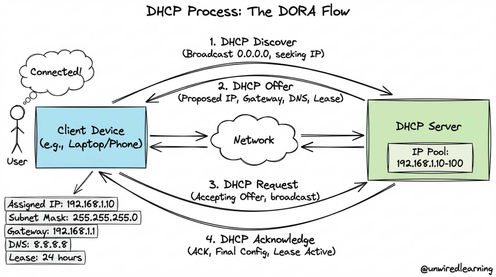

## Introduction

Subnetting, DHCP, and port allocation are three fundamental networking concepts that work together to make networks functional, organized, and secure. These topics are essential for understanding how devices communicate and how network administrators manage large networks.

---

## Part 1: Subnetting

### What is Subnetting?

Subnetting is the process of dividing one large network into smaller networks called **subnets**. It is done to make the network easier to manage, more secure, and more efficient.

### IP Address Structure

Every IP address has two parts:

| Part | Purpose |
|------|---------|
| **Network portion** | Identifies the network |
| **Host portion** | Identifies the device inside that network |

### Subnet Mask

A **subnet mask** is used to separate these two parts. For example:

- `255.255.255.0` (traditional notation)
- `/24` (CIDR notation)

Both mean: the first 24 bits are for the network and the remaining bits are for hosts.

### Key Benefit

All devices in the same subnet can communicate directly without needing a router.

---

## Important Subnetting Terms

### Core Concepts

| Term | Definition | Example |
|------|-----------|---------|
| **IP Address** | Unique address of a device on a network | 192.168.1.100 |
| **Subnet Mask** | Shows which bits are network, which are host | 255.255.255.0 or /24 |
| **CIDR Notation** | Shortened form indicating network bits | /24, /26, /30 |
| **Network Address** | The first address in a subnet | 192.168.1.0 |
| **Broadcast Address** | The last address in a subnet | 192.168.1.255 |
| **Usable Host Range** | IP addresses available for devices | 192.168.1.1 to 192.168.1.254 |

### Practical Example

If you have `192.168.1.0/24`:

```
Network address       = 192.168.1.0
Broadcast address     = 192.168.1.255
Usable host range     = 192.168.1.1 to 192.168.1.254
Total usable hosts    = 254 devices
```

---

## Why Subnetting is Used

### Organizational Benefits

Subnetting is used to organize networks properly:

- A company may want separate subnets for **HR**, **IT**, **students**, **guests**, or **servers**
- Keeps traffic organized and makes network control easier
- Improves security by separating departments

### Technical Benefits

1. **Reduces broadcast traffic** — Broadcast messages stay within a subnet
2. **Improves performance** — Less unnecessary network traffic
3. **Increases security** — Separate subnets can have different security policies
4. **Saves IP addresses** — Assign exactly what you need instead of wasting addresses

### Routing Benefits

Routers use subnet information to decide where packets should go:

- Without subnetting, a large flat network would be harder to control
- Creates unnecessary traffic
- Makes network scalability impossible

---

## How Subnetting Works

### Borrowing Bits

Subnetting works by borrowing bits from the host portion of an IP address and using them to create more network bits.

**Key principle:**

- More subnet bits = more subnets (but fewer hosts per subnet)
- More host bits = fewer subnets (but more hosts per subnet)

### Examples of Subnet Sizes

| CIDR | Subnet Mask | Hosts per Subnet | Use Case |
|------|-------------|-----------------|----------|
| `/24` | 255.255.255.0 | 254 | Standard small office/department |
| `/26` | 255.255.255.192 | 62 | Smaller departments |
| `/28` | 255.255.255.240 | 14 | Small workgroups |
| `/30` | 255.255.255.252 | 2 | Point-to-point links (routers) |
| `/16` | 255.255.0.0 | 65,534 | Large enterprise network |

### Subnet Size Trade-off

```
Borrowing more bits for network:
/24 → /26 → /28 → /30

More subnets created ↑
Hosts per subnet    ↓
```

---

## Subnetting Examples

### Example 1: Basic /24 Network

```
Network:     192.168.1.0/24
Mask:        255.255.255.0
First host:  192.168.1.1
Last host:   192.168.1.254
Broadcast:   192.168.1.255
Total hosts: 254
```

### Example 2: Smaller /26 Subnets

Original: `192.168.1.0/24` can be divided into four `/26` subnets:

```
Subnet 1:    192.168.1.0/26     (1-62)
Subnet 2:    192.168.1.64/26    (65-126)
Subnet 3:    192.168.1.128/26   (129-190)
Subnet 4:    192.168.1.192/26   (193-254)
```

### Example 3: Point-to-Point /30 Links

For router-to-router connections:

```
Subnet:      192.168.1.0/30
Hosts:       192.168.1.1 (Router A)
             192.168.1.2 (Router B)
Only 2 usable IPs needed
```

---

## Part 2: DHCP (Dynamic Host Configuration Protocol)

### What is DHCP?

**DHCP** means **Dynamic Host Configuration Protocol**. It is a network service that automatically assigns IP addresses and other network settings to devices.



### Without DHCP

Every device would need to be configured manually:

- Network administrator assigns each IP manually
- Time-consuming and error-prone
- Changes are difficult to make
- Not scalable for large networks

### With DHCP

DHCP automatically gives devices:

- **IP address** — Unique address for the device
- **Subnet mask** — Network configuration
- **Default gateway** — Router for external traffic
- **DNS server information** — For domain name resolution

### Where DHCP is Used

- Homes with WiFi networks
- Schools and universities
- Office networks
- Hotels and public WiFi
- Any network where devices frequently join and leave

---

## The DHCP Process (DORA)

### Four-Step Process

The DHCP process usually follows four steps, remembered as **DORA**:

#### Step 1: Discover

```
Client                              DHCP Server
   │                                    │
   ├──── DHCP Discover (broadcast) ────>│
   │    (looking for DHCP server)       │
   │                                    │
```

The client broadcasts a request looking for a DHCP server.

#### Step 2: Offer

```
Client                              DHCP Server
   │                                    │
   │<──── DHCP Offer ─────────────────┤
   │      (IP: 192.168.1.105)          │
   │      (masks, gateway, DNS)        │
   │                                    │
```

The server offers an available IP address with network settings.

#### Step 3: Request

```
Client                              DHCP Server
   │                                    │
   ├──── DHCP Request ─────────────────>│
   │      (accept offered IP)           │
   │                                    │
```

The client requests the offered address.

#### Step 4: Acknowledge (ACK)

```
Client                              DHCP Server
   │                                    │
   │<──── DHCP ACK ────────────────────┤
   │      (IP lease confirmed)          │
   │      (lease time: 24 hours)        │
   │                                    │
```

The server confirms the lease and network settings.

### DORA Summary Table

| Step | Sender | Message | Purpose |
|------|--------|---------|---------|
| **Discover** | Client | Broadcast request | Find DHCP server |
| **Offer** | Server | Offer IP + settings | Propose configuration |
| **Request** | Client | Accept offer | Request specific IP |
| **ACK** | Server | Confirm lease | Complete assignment |

---

## DHCP Lease

### What is a Lease?

The IP address assigned by DHCP is usually not permanent. It is given for a certain period called a **lease**.

### Lease Characteristics

```
IP Address Assigned ──→ Lease Active ──→ Lease Expires
    │                      │                    │
  DHCP gives IP         Device uses IP      Device loses IP
                       for lease period    (if not renewed)
```

### Lease Renewal

When the lease ends, the client may:

- **Renew** the same IP address
- **Get a new address** from the DHCP server

### Why Leases Exist

1. **Reuse addresses** — If device disconnects, address can be reassigned
2. **Efficient IP usage** — Network administrators can reuse limited addresses
3. **Clean network** — Old devices automatically lose IPs
4. **Flexibility** — Addresses can be redistributed as needed

### Typical Lease Times

| Duration | Use Case |
|----------|----------|
| 8 hours | Shared public networks (libraries, cafes) |
| 24 hours | Office networks |
| 7 days | Home networks |
| 1 hour | Temporary devices |

---

## DHCP Scope

### What is a DHCP Scope?

A **DHCP scope** is the range of IP addresses the server can assign to devices.

### Example

```
DHCP Scope: 192.168.1.100 to 192.168.1.200
Available addresses: 101 IPs for devices
```

### DHCP Server Manages

| Item | Purpose |
|------|---------|
| **Reserved addresses** | IPs for specific devices (printers, servers) |
| **Excluded addresses** | IPs never to be assigned |
| **Lease times** | How long each device keeps its IP |
| **Options** | Gateway, DNS, domain name, etc. |

### Multiple Subnets Need Multiple Scopes

In a network with multiple subnets, each subnet usually needs its own DHCP scope.

**Why?** DHCP must assign addresses that match the correct subnet:

```
Subnet 1 (192.168.1.0/24)
└─ DHCP Scope: 192.168.1.100-200

Subnet 2 (192.168.2.0/24)
└─ DHCP Scope: 192.168.2.100-200

Subnet 3 (192.168.3.0/24)
└─ DHCP Scope: 192.168.3.100-200
```

---

## DHCP Reservation

### What is a DHCP Reservation?

A **DHCP reservation** means the server always gives the same IP address to a specific device based on its **MAC address**.

### Example

```
Device: Printer (MAC: 00:1A:2B:3C:4D:5E)
Always gets: 192.168.1.50

Server recognizes the MAC address
and assigns the same IP every time
```

### Useful For

- **Printers** — Need consistent IP for drivers
- **Servers** — Should maintain stable addresses
- **Important devices** — Critical equipment needs reliable IPs
- **Scanners and copiers** — Need known addresses for configuration

### Benefits

1. **Convenience** — Automatic configuration (DHCP)
2. **Stability** — Fixed address (no IP changes)
3. **Best of both worlds** — Combines DHCP ease with static IP reliability

---

## DHCP and Subnetting Relationship

### How They Connect

DHCP and subnetting are closely connected:

- A DHCP server must assign an IP address that belongs to the correct subnet
- The IP must match the subnet mask of where the device is located

### The Challenge

If the device is on a different subnet from the DHCP server:

- A **relay agent** or **helper address** is often needed
- Forwards DHCP requests to the correct DHCP server
- Ensures device gets an IP from its own subnet

### Example

```
Device on Subnet 2
(192.168.2.0/24)
     │
     └─→ DHCP Relay Agent
            │
            └─→ DHCP Server (on Subnet 1)
                    │
                    └─→ Assigns 192.168.2.X
                         (IP from Subnet 2 scope)
```

### Planning Subnets and DHCP

Subnetting design must be planned carefully:

| Too Small | Just Right | Too Large |
|-----------|-----------|-----------|
| Devices run out of addresses | Enough IPs for growth | Network becomes messy |
| Frequent conflicts | Organized | Hard to manage |
| Inefficient | Efficient | Inefficient |

---

## Part 3: Port Allocation

### What is Port Allocation?

**Port allocation** is the process of assigning port numbers to different services running on a computer. A **port** helps identify which application should receive network traffic on a machine.

### The Concept

| Item | Identifies |
|------|-----------|
| **IP Address** | Which device on the network |
| **Port Number** | Which service/application on that device |

### Example

```
Server: 192.168.1.50

Services running:
├─ Web (HTTP)     → Port 80
├─ Web (HTTPS)    → Port 443
├─ SSH            → Port 22
└─ DNS            → Port 53

Packet to 192.168.1.50:80 → Web Server
Packet to 192.168.1.50:443 → Secure Web
Packet to 192.168.1.50:22 → SSH Server
Packet to 192.168.1.50:53 → DNS Server
```

### Why Port Allocation Matters

One server can have one IP address but many services. Ports distinguish between them.

---

## Port Numbers and Categories

### Port Range

Port numbers range from **0 to 65,535** (65,536 total ports).

### Three Categories

| Category | Range | Usage | Examples |
|----------|-------|-------|----------|
| **Well-known** | 0–1,023 | Standard services | HTTP(80), HTTPS(443), SSH(22) |
| **Registered** | 1,024–49,151 | Applications | Custom apps, databases |
| **Dynamic/Private** | 49,152–65,535 | Temporary, clients | Client applications |

### Common Well-Known Ports

| Port | Service | Protocol |
|------|---------|----------|
| 20, 21 | FTP | TCP |
| 22 | SSH | TCP |
| 25 | SMTP | TCP |
| 53 | DNS | TCP/UDP |
| 80 | HTTP | TCP |
| 110 | POP3 | TCP |
| 143 | IMAP | TCP |
| 443 | HTTPS | TCP |
| 3306 | MySQL | TCP |
| 5432 | PostgreSQL | TCP |

### Why Categories Exist

- **Avoid conflicts** — Standard ports are reserved
- **Organization** — Clear structure for services
- **Security** — Prevents accidental port conflicts
- **Scalability** — Enough ports for any network

---

## How Port Allocation Works

### Service Listening

When a server application starts, it **listens on a specific port**:

```
1. Application starts
        │
2. Binds to port (e.g., port 80)
        │
3. Listens for incoming connections
        │
4. When client connects, traffic goes to this application
```

### Example Flow

```
Browser                         Server (192.168.1.50)
   │                                    │
   ├─ Connect to 192.168.1.50:80 ─────>│
   │                          (port 80 is HTTP)
   │                                    │
   │<────── Web Server responds ────────┤
   │        (running on port 80)        │
   │                                    │
```

### Port Conflicts

If two services try to use the same port on the same IP address:

```
Service A: trying to bind to port 80
Service B: already using port 80

ERROR: Port already in use
Service A cannot start
```

**Solution:** Assign Service B to a different port (like 8080).

---

## Importance of Port Allocation

### Multiple Services on One Computer

Port allocation allows multiple services to run simultaneously:

```
Web Server
├─ HTTP  → Port 80
├─ HTTPS → Port 443
└─ Admin → Port 8080

Database
└─ MySQL → Port 3306

All running at same time
All using same IP address
Identified by different ports
```

### Network Security

Firewalls use ports to control access:

```
Allow port 80 (HTTP)
Allow port 443 (HTTPS)
Block all others

Only web traffic allowed
Other services protected
```

### Real-World Uses

Port allocation is important for:

| Use | Benefit |
|-----|---------|
| **Separate services** | Keep different apps isolated |
| **Secure access** | Firewall can allow/block specific ports |
| **Control traffic** | Routers direct traffic based on ports |
| **Manage servers** | Admin can run multiple services |
| **Support communication** | Client-server can use specific ports |

---

## Port Binding and Application Configuration

### How Applications Bind to Ports

```bash
# Web server configuration
Server listens on 0.0.0.0:80
(any IP on this machine, port 80)

# When client connects to 192.168.1.50:80
Kernel directs traffic to listening application
```

### Example Configurations

```
Web Server    → Port 80
Web Server 2  → Port 8080
Database      → Port 3306
SSH Server    → Port 22
FTP Server    → Port 21
```

### Port Mapping in Docker

In containerized environments, ports are mapped:

```
Host Port : Container Port
8080 : 80

External: 192.168.1.50:8080
    ↓
Container: localhost:80
    ↓
Web server inside container
```

---

## Subnetting, DHCP, and Ports Together

### How These Three Work Together

These three topics are connected in real networking:

```
Subnetting
    │
    └─→ Divides network into logical sections (192.168.1.0/24)
            │
            └─→ DHCP assigns addresses in the subnet (192.168.1.105)
                    │
                    └─→ Port allocation identifies services (port 443, 80, 22)
```

### Real-World Example

```
Scenario: A user connects to work VPN

1. DHCP gives laptop an IP:        192.168.1.105
2. Subnet configuration is:         /24 (belongs to 192.168.1.0/24)
3. Laptop connects to web server via port 443 (HTTPS)
4. DNS server found via DHCP:      192.168.1.1:53

Everything works together!
```

### Network Architecture

```
┌─────────────────────────────────────────────────┐
│ Company Network: 192.168.0.0/16                 │
│                                                  │
│  ┌──────────────────┐  ┌──────────────────┐   │
│  │ Subnet 1: /24    │  │ Subnet 2: /24    │   │
│  │ DHCP Scope:      │  │ DHCP Scope:      │   │
│  │ 100-150          │  │ 100-150          │   │
│  └──────────────────┘  └──────────────────┘   │
│                                                  │
│  Services on each device:                      │
│  Port 80   (HTTP)                              │
│  Port 443  (HTTPS)                             │
│  Port 22   (SSH)                               │
│  Port 3306 (Database)                          │
└─────────────────────────────────────────────────┘
```

---

## Comparison Summary

### Simple Comparison

| Topic | Main Role | Example |
|-------|-----------|---------|
| **Subnetting** | Divides a large network into smaller parts | 192.168.1.0/24 |
| **DHCP** | Automatically gives IP configuration | Assigning 192.168.1.105 |
| **Port Allocation** | Identifies services on a device | HTTP on 80, SSH on 22 |

### What Each Solves

| Problem | Solution | How |
|---------|----------|-----|
| **Network too large** | Subnetting | Divide into /24, /25, etc. |
| **Manual IP config** | DHCP | Automatic assignment |
| **Multiple services conflict** | Port Allocation | Use different ports |

### Their Relationships

```
Subnetting
    └─→ Defines network boundaries
            │
            └─→ DHCP assigns IPs within boundaries
                    │
                    └─→ Ports allow multiple services per IP
```

---

## Quick Reference Guide

### Subnetting

| Concept | Key Point |
|---------|-----------|
| Network/Host split | Subnet mask determines which bits are network |
| /24 notation | 24 network bits, 8 host bits |
| Broadcast | Last address in subnet (cannot assign) |
| Usable range | First+1 to Last-1 |
| Reason | Organize, secure, and optimize networks |

### DHCP

| Concept | Key Point |
|---------|-----------|
| DORA | Discover, Offer, Request, Acknowledge |
| Lease | IP is temporary, not permanent |
| Scope | Range of IPs available to assign |
| Reservation | Assign same IP to specific MAC address |
| Relay | Forward DHCP across subnets |

### Port Allocation

| Concept | Key Point |
|---------|-----------|
| Port range | 0-65,535 total ports |
| Well-known | 0-1,023 for standard services |
| Registered | 1,024-49,151 for applications |
| Dynamic | 49,152-65,535 for clients |
| Listening | Service binds to port to accept connections |

---

## Short Revision Notes

### Subnetting

- Subnetting splits a network into smaller subnets
- Subnet mask separates network and host parts
- `/24` means 24 network bits, 8 host bits
- Useful for organization, security, and IP efficiency

### DHCP

- DHCP automatically assigns IP addresses and network settings
- DHCP uses Discover, Offer, Request, and ACK
- Lease means IP is temporary
- Scope is the range of assignable IPs
- Reservation gives same IP to specific device

### Ports

- Port allocation assigns port numbers to services
- IP address identifies the device, port identifies the service
- Well-known ports (0-1023) are standard services
- Prevents conflicts between multiple services

---

## Easy Memory Tricks

| Concept | Memory Trick |
|---------|-------------|
| **Subnetting** | Divide the network into smaller pieces |
| **DHCP** | Give the IP automatically, not manually |
| **Port allocation** | Choose which service gets the traffic |
| **DORA** | Discover → Offer → Request → Acknowledge |
| **/24** | 24 bits for network, 8 bits for hosts |
| **Well-known** | Ports 0-1023 are reserved for standard services |
| **Lease** | IP is borrowed, not owned |
| **Reservation** | MAC address gets same IP every time |

---

## Decision Trees

### When to Use What?

#### Subnetting Decisions

```
Network too large?
└─ Yes → Need subnetting
         Divide by department, location, or function

How many devices?
├─ Few (< 30) → Use /26 or /27
├─ Medium (30-100) → Use /24
└─ Many (100+) → Use /22 or larger
```

#### DHCP Configuration

```
Device needs IP?
├─ Many devices, frequently changing → Use DHCP
├─ Important device, needs same IP → Use DHCP + Reservation
└─ Must be absolutely fixed → Use static IP

Multiple subnets?
└─ Yes → Need DHCP relay agents
```

#### Port Selection

```
Running a web server?
├─ Public HTTP → Port 80
├─ Secure HTTPS → Port 443
└─ Testing only → Port 8080

Custom application?
└─ Use port 1024+ (registered/dynamic)
```

---

## Summary

Subnetting, DHCP, and port allocation are the three pillars of network organization:

### Subnetting

- **Divides** large networks into manageable pieces
- **Improves** security and efficiency
- **Uses** subnet masks and CIDR notation

### DHCP

- **Automates** IP address assignment
- **Uses** DORA process (4 steps)
- **Works with** subnets through scopes

### Port Allocation

- **Enables** multiple services on one device
- **Uses** standardized port numbers
- **Prevents** service conflicts

### Working Together

These three create a complete networking infrastructure where:

- Networks are properly divided (subnetting)
- Devices get IPs automatically (DHCP)
- Services are accessible via ports (port allocation)

### Key Takeaway

All three must work together for a network to function properly. Subnetting creates the structure, DHCP fills it with devices, and ports make services accessible.
