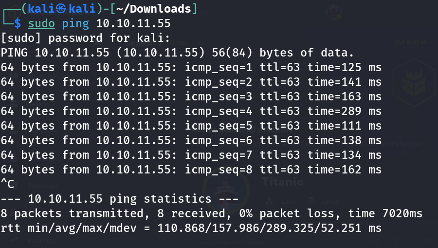

# Titanic

Titanic

**1. Initial Reconnaissance**

**Ping Test:**

- Firstly I performed a ping command to confirm whether the host is up.



**Nmap Scan:**

- I then conducted an Nmap scan to detect open ports, services, and OS version.


***Result*** 

- there are two ports open :
    - 22 ssh
    - 80 http

Since I got the http port up, I checked the IP address in the browser and got this error result.


Then I edited the */etc/hosts* file using Vim to resolve the domain **titanic.htb.** I then verified DNS resolution by reloading and accessing the site.


Then I was able to successfully reload the configuration and access the site.


1. **Website Analysis**

**Wappalyzer**

I used the wappalyzer extension to analyze the web technologies used on the site.


this is the summary of the site 


- the website used:
    - python (3.10.12) as a programming language
    - Flask (3.0.3) as a web server
    - Bootstrap (4.5.2) as UI framework

I searched for vulnerabilities in exploit db and got nothing


1. **Directory Brute forcing**

Then I ran ffuf to brute-force the directories.


After brute forcing, I found two subdomains:

- book
- server-status

I then navigated to the book domain and found this. I was not able to visit the site


Then I checked the server-status domain and this time the site was forbidden.


### 5. Advanced Scanning

- **Feroxbuster**

I used the Ferobuster tool to find the subdomains of the Titanic page


Found only two 202 status code. Let’s check both the site 
I then navigated to the [http://titanic.htb/static/styles.css](http://titanic.htb/static/styles.css) page that I found in the result.

But I didn’t find any interesting. It was just the CSS code. 


**Nikto Scan:**

Used Nikto for vulnerability scanning.


After doing the scan I got the one directory. Let’s check this one

Found [http://titanic.htb/static/assets/images/favicon.ico](http://titanic.htb/static/assets/images/favicon.ico).


I was just the image of the Titanic image used.

Then I explored the booking system to understand its behavior.


After submitting the booking button, I got the JSON file. Let’s check this file. 


I just found the details from the JSON file.


So, after that, I again used ffuf brute forcing to find the subdomains


**Result**

- found *dev* domain

added ***dev.titanic.htb*** in /etc/hosts file 

```jsx
sudo vim /etc/hosts
```


I got this page 


I explored all the necessary navigation on the website and after navigating on the explore button I got the developer site.

Also, I used ffuf for brute forcing the dev domain to find the subdomains


As a result, I got:

- administrator
- developer
- v2

after that to find the valid status code and the path I used feroxbuster tool.


found 43 valid 202 status code and checked each and every one. Then I found the flask-app directory.

Explored the development course 


Inside the flask-app directory, I found this [app.py](http://app.py) code. this might be vulnerable.


As I got the Python code, I fed the code to the AI and got ideas on how to exploit the machine that could be vulnerable. 

From the result I found that the ticket parameter is used to construct a file path, this allows an attacker to request arbitrary files outside the directory using path traversal.

- Request `/download?ticket=../../../../etc/passwd` in the header side might return the system's password file.

**Lack of authentication**

- anyone can book and download the ticket
- attackers can brute-force.
- attackers can guess the ticket filename to download other users’ tickets.

I used Burp Suite to intercept the network and followed each step. 

I then used the path traversal vulnerabilities upon downloading the ticket.


This is the response I got.


from the above information:

- developer user was found
- another user called _laurel and there is no login shell
- user developer has a home directory(/home/developer) and a **bash shell**

I read [gitea documentation](https://docs.gitea.com/installation/install-with-docker) to find the location of any configuration files. 

Upon reading this documentation 

I found this useful information:


From the information we got earlier, we know that there is a developer user and now we get that those endpoints can be used by the user having the advantage to download the files using the endpoint.  


after this, I found that the database has another file called gitea.db from the database path.

There might be vulnerabilities in this gitea.db file. So, I downloaded this file.


After downloading the gitea.db file. I have extracted the hash from the gitea file to get the users.


Used hashcat to crack the password of the gitea file.


After cracking the user hashes I got the password of the developer user. 

Now I will be able to get into the SSH port 22 with the user developer. Let’s try this

### **ssh login**

Used developer as a user.


- After listing the file I got the user.txt flag.

I then used the find command to find directories where we have the write access. I found the identify_images.sh file with write access.


Found that the scripts folder uses ImageMagick. I checked the version of this.


Found that the version is 7.1.1-35

After searching the vulnerabilities of ImageMagick version 7.1.1-35, I found the known vulnerability. 

[Arbitrary Code Execution in `AppImage` version `ImageMagick`](https://github.com/ImageMagick/ImageMagick/security/advisories/GHSA-8rxc-922v-phg8)

This allows running code by placing a malicious shared library in the working directory.

- we can exploit it by placing a fake library inside this file.


This is the code that I found after reading the ImageMagick vulnerability.

After running this I got the root flag. 


